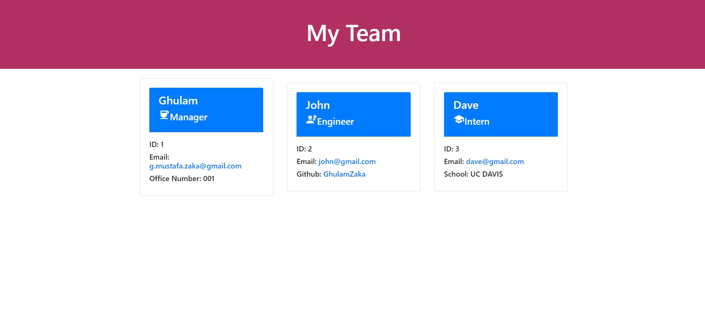
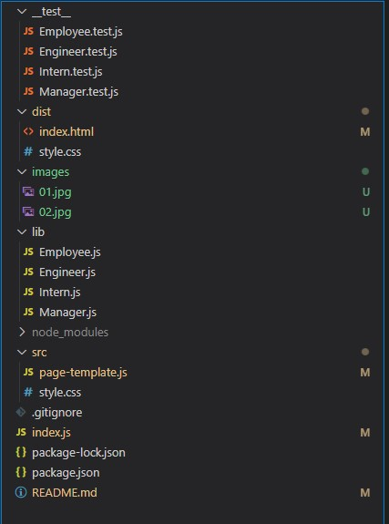

# Team-profile-generator

## Description

- This application will allow user's to create their team by entering the information on the command-line.
- This application will be access by node.js in the command-line.
- User's can to enter information for the manager, engineer and intern.
- This application will use jest to test for running test on different units and will use inquirer to get the input information of the users.
- When all the input information is completed, the user will be prompted with a message the the team profil has been created and it will give the location of the the directory in which the html file is created.
- The HTML page contains different cards base on the input role such as manager, engineer, and Intern.
- In the managers cards clients can email to manager by clicking the email link.
- In the engineer and intern cards the users can use the email and github link to contact them.

## Github repository URL

https://github.com/GhulamZaka/Team-profile-generator

## Walkthrough vedio link

https://drive.google.com/file/d/1lC9RPfu3FaXTaCg10nGmVqYZiZQ0IedP/view?usp=sharing

## HTML file

file:///C:/Users/G.Mustafa%20Zaka/gmzprojects/Team-profile-generator/dist/index.html

## Screenshoots

